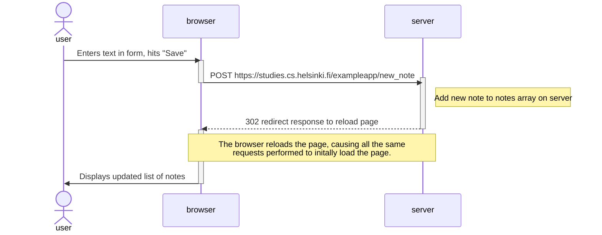

```mermaid
sequenceDiagram
    actor user
    participant browser
    participant server

    user->>browser: Enters text in form, hits "Save"
    activate browser

    browser->>server: POST https://studies.cs.helsinki.fi/exampleapp/new_note
    activate server
    deactivate browser
    Note right of server: Add new note to notes array on server
    server-->>browser: 302 redirect response to reload page
    deactivate server
    activate browser

    Note over browser, server: The browser reloads the page, causing all the same<br> requests performed to initally load the page.

    browser ->> user: Displays updated list of notes
    deactivate browser
```
