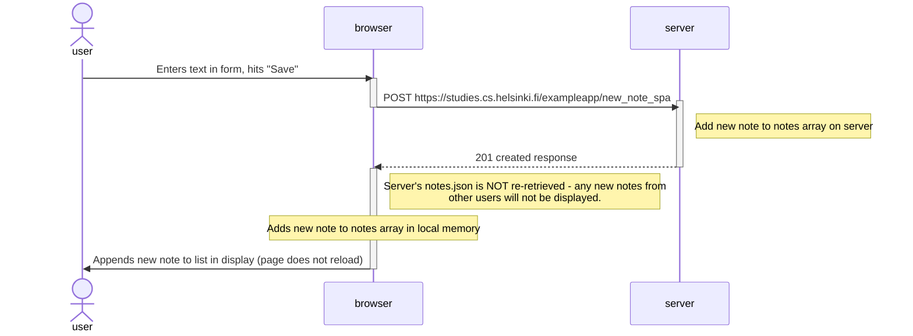

```mermaid
sequenceDiagram
    actor user
    participant browser
    participant server

    user->>browser: Enters text in form, hits "Save"
    activate browser

    browser->>server: POST https://studies.cs.helsinki.fi/exampleapp/new_note_spa
    activate server
    deactivate browser
    Note right of server: Add new note to notes array on server
    server-->>browser: 201 created response
    deactivate server
    activate browser

    Note right of browser: Server's notes.json is NOT re-retrieved - any new notes from <br> other users will not be displayed.

    Note over browser: Adds new note to notes array in local memory

    browser ->> user: Appends new note to list in display (page does not reload)
    deactivate browser
```
